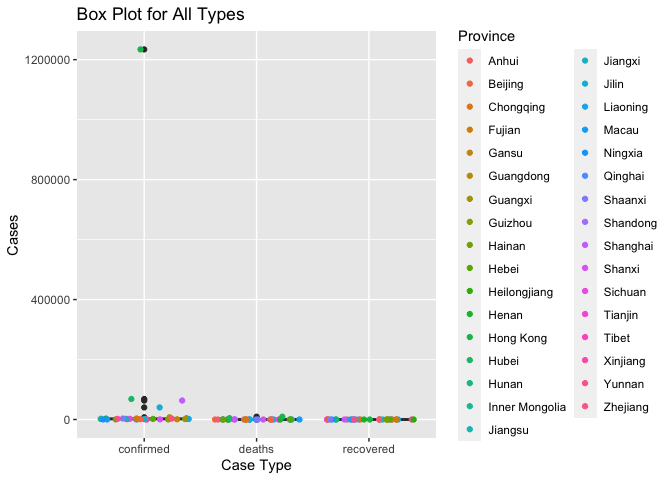

ST558 Project1
================
Shan Luo
2022-06-26

``` r
rmarkdown::render("/Users/sl666/Desktop/ST558/ST558Project1/ST558Project1.Rmd", 
          output_format = "github_document",
          output_file = "README.md",
          output_options = list(
            html_preview = FALSE))
```

# Package List

The Following Packages are used in this project:

[`tidyverse`](https://www.tidyverse.org)  
[`jsonlite`](https://cran.r-project.org/web/packages/jsonlite/)  
[`ggplot2`](https://ggplot2.tidyverse.org)

# API Interaction Functions

`countrysummary`

This function returns a data.frame with COVID status summaries without
“Premium” variable for different countries. The default setting is to
return all countries’ summaries, but the summaries for a specific
country can also be returned.

``` r
countrysummary <- function(country = "all"){
  ###
  # This function return a data.frame with COVID summary without "Premium" for all   # countries.
  ###
  
  # Get summary data from summary endpoint.
  outputAPI <- fromJSON("https://api.covid19api.com/summary")
  
  # Select only data.frame from JSON output
  output <- outputAPI$Countries
  
  # If country does not equal "all", check if it is a specific country name, code
  # or slug.
  if (country != "all"){
    
    # If country is in country name, subset output for just that row.
    if (country %in% output$Country){
      output <- output %>% 
        filter(Country == country) %>%
        select(-Premium)
    }
    # If country is in country code, subset output for just that row.
    else if (country %in% output$CountryCode){
      output <- output %>% 
        filter(CountryCode == country) %>%
        select(-Premium)
    }
    # If country is in slug, subset output for just that row.
    else if (country %in% output$Slug){
      output <- output %>% 
        filter(Slug == country) %>%
        select(-Premium)
    }
    # Otherwise, throw an information error.
    else{
      message <- paste("ERROR: Argument for country was not found in",
                       "the Country, CountryCode, or Slug columns. Try",
                       "countrysummary('all') to find the country you're",
                       "looking for.")
      stop(message)
    }
  }
  # Do nothing if country value equals "all".
  else{
    
  } 
  # Return the output data.frame.
  return(output)
}
```

`findCountry`

This function returns a data.frame of country name, country code and
slug for different countries. The default setting is to return country
name, country code and slug for all countries. User can ask for a
specific country.

``` r
findCountry <- function(country = 'all'){
  ###
  # This function return a data.frame of Country,CountryCode, Slug for all
  # countries.
  #
  
  # Get summary data from countries endpoint.
  outputAPI <- fromJSON("https://api.covid19api.com/countries")
  
  # Rename the ISO2 column as CountryCode
  output <- outputAPI %>% rename(CountryCode = ISO2)
  
  # If country does not equal "all", check if it is a specific country.
  if (country != "all"){
    
    # If country is in country name, subset output for just that row.
    if (country %in% output$Country){
      output <- output %>%
        filter(Country == country) 
    }
    # If country is in country code, subset output for just that row.
    else if (country %in% outputAPI$CountryCode){
      output <- output %>% 
        filter(CountryCode == country) 
    }
    # If country is in slug, subset output for just that row.
    else if (country %in% outputAPI$Slug){
      output <- output %>% 
        filter(Slug == country) 
    }
    # Otherwise, throw an information error.
    else{
      message <- paste("ERROR: Argument for country was not found in",
                       "the Country, CountryCode, or Slug columns. Try",
                       "findCountry('all') to find the country you're",
                       "looking for.")
      stop(message)
    }
  }
  # Output all if country value equals "all".
  else{

  } 
  # Return the output data.frame.
  return(output)
}
```

`Getdayone`

This function returns a data.frame for all cases by different case types
for a country from the first recoreded case. The default setting is to
return all cases for all case types - confirmed, deaths, recovered. A
specific case type for a country can be returned.

``` r
Getdayone <- function(country, status = 'all'){
  ###
  # This function returns a data.frame for all cases by case type for a country     # from the first recorded case.
  ###
  
  # find Slug for specific country
  slug <- findCountry(country)$Slug
  
  # Set the base url, endpoint, status.
  baseURL <- "https://api.covid19api.com/"
  endpoint <- "dayone/country/"
  statusURL <- "/status/"
  
  # If case status does not equal "all", check if it is a specific status:
  # confirmed, recovered, deaths
  if (status != "all"){
    
    # If status is confirmed, output case for confirmed.
    if (status == "confirmed"){
      fullURL <- paste0(baseURL, endpoint, slug, statusURL, status)
      output <- fromJSON(fullURL)
    }
    # If status is recovered, output case for recovered.
    else if (status == "recovered"){
      fullURL <- paste0(baseURL, endpoint, slug, statusURL, status)
      output <- fromJSON(fullURL)
    }
    # If status is deaths, output case for deaths
    else if (status == "deaths"){
      fullURL <- paste0(baseURL, endpoint, slug, statusURL, status)
      output <- fromJSON(fullURL)
    }
    # Otherwise, throw an information error
    else{
      message <- paste("ERROR: Argument for status was not correct.",
                       "Try correct status: all, confirmed, recovered, deaths.")
      stop(message)
    }
  }
  # Output all case status for required country
  else{
    fullURL <- paste0(baseURL, endpoint, slug)
    output <- fromJSON(fullURL)
  }
  # Return the output data.frame.
  return(output)
}
```

`GetdayoneLive`

This function returns a data.frame for all cases by case type for a
country from the first recorded case with the latest record being the
live count. The default setting is with live count. This function cannot
return all case type for all countries, so a specific case type and
country are required.

``` r
GetdayoneLive <- function(country, status, live = TRUE){
  ###
  # This function returns a data.frame for all cases by case type for a country
  # from the first recorded case with the latest record being the live count.
  ###
  
  # Find slug for specific country
  slug <- findCountry(country)$Slug
  
  # Set the base url, endpoint, status.
  baseURL <- "https://api.covid19api.com/"
  endpoint <- "dayone/country/"
  statusURL <- "/status/"
  
  # If live equal TRUE, output all cases for corresponding status.
  if (live == TRUE){
    liveStatus <- "/live"
    # If status is confirmed, output all cases
    if (status == "confirmed"){
      fullURL <- paste0(baseURL, endpoint, slug, statusURL, status, liveStatus)
      output <- fromJSON(fullURL)
    }
    # If status is recovered, output case for recovered.
    else if (status == "recovered"){
      fullURL <- paste0(baseURL, endpoint, slug, statusURL, status, liveStatus)
      output <- fromJSON(fullURL)
    }
    # If status is deaths, output case for deaths
    else if (status == "deaths"){
      fullURL <- paste0(baseURL, endpoint, slug, statusURL, status, liveStatus)
      output <- fromJSON(fullURL)
    }
    # Otherwise, throw an information error
    else{
      message <- paste("ERROR: Argument for status was not correct.",
                       "Try correct status: confirmed, recovered, deaths.")
      stop(message)
    }
  }
  # If live equal FALSE, output all case for corresponding status
  else{
    # If status is confirmed, output all cases
    if (status == "confirmed"){
      fullURL <- paste0(baseURL, endpoint, slug, statusURL, status)
      output <- fromJSON(fullURL)
    }
    # If status is recovered, output case for recovered.
    else if (status == "recovered"){
      fullURL <- paste0(baseURL, endpoint, slug, statusURL, status)
      output <- fromJSON(fullURL)
    }
    # If status is deaths, output case for deaths
    else if (status == "deaths"){
      fullURL <- paste0(baseURL, endpoint, slug, statusURL, status)
      output <- fromJSON(fullURL)
    }
    # Otherwise, throw an information error
    else{
      message <- paste("ERROR: Argument for status was not correct.",
                       "Try correct status: confirmed, recovered, deaths.")
      stop(message)
    }
  }
  # Return output data.frame
  return(output)
}
```

sa \<- Getdayone(‘south-africa’, ‘confirmed’) saL \<-
GetdayoneLive(‘south-africa’,‘confirmed’, TRUE) saNL \<-
GetdayoneLive(‘south-africa’,‘confirmed’,FALSE)

`GetdayoneTotal`

This function returns a data.frame for total cases by case type for a
country from the first recorded case. The default setting is to return
total cases for all case types for a country. A specific country are
requuired.

``` r
GetdayoneTotal <- function(country, status = 'all'){
  ###
  # This function returns a data.frame for all cases by case type for a country     # from the first recorded case.
  ###
  
  # find Slug for specific country
  slug <- findCountry(country)$Slug
  
  # Set the base url, endpoint, status.
  baseURL <- "https://api.covid19api.com/"
  endpoint <- "total/dayone/country/"
  statusURL <- "/status/"
  
  # If case status does not equal "all", check if it is a specific status:
  # confirmed, recovered, deaths
  if (status != "all"){
    
    # If status is confirmed, output case for confirmed.
    if (status == "confirmed"){
      fullURL <- paste0(baseURL, endpoint, slug, statusURL, status)
      output <- fromJSON(fullURL)
    }
    # If status is recovered, output case for recovered.
    else if (status == "recovered"){
      fullURL <- paste0(baseURL, endpoint, slug, statusURL, status)
      output <- fromJSON(fullURL)
    }
    # If status is deaths, output case for deaths
    else if (status == "deaths"){
      ullURL <- paste0(baseURL, endpoint, slug, statusURL, status)
      output <- fromJSON(fullURL)
    }
    # Otherwise, throw an information error
    else{
      message <- paste("ERROR: Argument for status was not correct.",
                       "Try correct status: all, confirmed, recovered, deaths.")
      stop(message)
    }
  }
  # Output all case status for required country
  else{
    fullURL <- paste0(baseURL, endpoint, slug)
    output <- fromJSON(fullURL)
  }
  # Return the output data.frame.
  return(output)
}
```

`covidAPI`

This function is a wrapper function for all the others above. You simply
pass the name of the function you want to use, and any additional
arguments for that function.

``` r
covidAPI <- function(func, ...){
  ###
  # This function is a wrapper for the other functions.
  ###
  
  if (func == "countrysummary"){
    output <- countrysummary(...)
  }
  else if (func == "findCountry"){
    output <- findCountry(...)
  }
  else if (func == "Getdayone"){
    output <- Getdayone(...)
  }
  else if (func == "GetdayoneLive"){
    output <- GetdayoneLive(...)
  }
  else if (func == "GetdayoneTotal"){
    output <- GetdayoneTotal(...)
  }
  else{
    stop("ERROR: Argument for func is not valid!")
  }
  
  # Return the output from the appropriate function.
  return(output)
}
```

# Data Exploration

Now, we can interact with few of endpoints of the COVID API.

Let’s pull the all case with live count for different case types for
**China**.

``` r
# Get Day one live all case type for China.
cl <- covidAPI('GetdayoneLive', 'china', 'confirmed')
dl <- covidAPI('GetdayoneLive', 'china', 'deaths')
rl <- covidAPI('GetdayoneLive', 'china', 'recovered')
```

Let’s keep the variables that we are interested in, and keep cases until
*2022-06-24T00:00:00Z*. After filtering the data, I combine them and
reshape it for wide format for plotting use.

``` r
# Filtering for confirmed type
cl <- cl %>% group_by(Province) %>% 
  filter(Date == "2022-06-24T00:00:00Z") %>%
  select(Province, Cases, Status)
# Filtering for deaths type
dl <- dl %>% group_by(Province) %>% 
  filter(Date == "2022-06-24T00:00:00Z") %>%
  select(Province, Cases, Status)
# Filtering for recovered type
rl <- rl %>% group_by(Province) %>% 
  filter(Date == "2022-06-24T00:00:00Z") %>%
  select(Province, Cases, Status)
# Combine all types into long format
LStatusL <- full_join(cl, full_join(dl, rl))
```

    ## Joining, by = c("Province", "Cases", "Status")
    ## Joining, by = c("Province", "Cases", "Status")

``` r
# Reshape long format to wide and creating a new variable called DeathRate for each provinces.
LStatusW<- LStatusL %>% pivot_wider(id_cols = Province, 
                        names_from = Status,
                        values_from = Cases) %>%
  mutate(DeathRate = (deaths / confirmed)*100)
```

Let’s take look at both long and wide format data.

``` r
LStatusL
```

    ## # A tibble: 99 × 3
    ## # Groups:   Province [33]
    ##    Province     Cases Status   
    ##    <chr>        <int> <chr>    
    ##  1 Xinjiang      1008 confirmed
    ##  2 Shandong      2749 confirmed
    ##  3 Shanxi         423 confirmed
    ##  4 Chongqing      726 confirmed
    ##  5 Hunan         1401 confirmed
    ##  6 Beijing       3674 confirmed
    ##  7 Tibet            1 confirmed
    ##  8 Guizhou        185 confirmed
    ##  9 Jiangxi       1386 confirmed
    ## 10 Heilongjiang  2987 confirmed
    ## # … with 89 more rows

``` r
LStatusW
```

    ## # A tibble: 33 × 5
    ## # Groups:   Province [33]
    ##    Province     confirmed deaths recovered DeathRate
    ##    <chr>            <int>  <int>     <int>     <dbl>
    ##  1 Xinjiang          1008      3         0    0.298 
    ##  2 Shandong          2749      7         0    0.255 
    ##  3 Shanxi             423      0         0    0     
    ##  4 Chongqing          726      6         0    0.826 
    ##  5 Hunan             1401      4         0    0.286 
    ##  6 Beijing           3674      9         0    0.245 
    ##  7 Tibet                1      0         0    0     
    ##  8 Guizhou            185      2         0    1.08  
    ##  9 Jiangxi           1386      1         0    0.0722
    ## 10 Heilongjiang      2987     13         0    0.435 
    ## # … with 23 more rows

# Exploratory Data Analysis

## Numeric Summary Table

Let’s create numeric summary table.

``` r
# Numeric Summaries
LStatusL %>% 
  group_by(Status) %>% 
  summarise(
    Min    = round(min(Cases), digits = 0),
    Avg    = round(mean(Cases), digits = 0),
    Sd     = round(sd(Cases), digits = 0),
    Median = round(median(Cases), digits = 0),
    IQR    = round(IQR(Cases), digits = 0),
    Max    = round(max(Cases), digits = 0))
```

    ## # A tibble: 3 × 7
    ##   Status      Min   Avg     Sd Median   IQR     Max
    ##   <chr>     <dbl> <dbl>  <dbl>  <dbl> <dbl>   <dbl>
    ## 1 confirmed     1 44236 214262   2007  2457 1234166
    ## 2 deaths        0   443   1790      3     6    9398
    ## 3 recovered     0     0      0      0     0       0

From the table, none of provinces have any recovered case. A few
provinces have no deaths case, and all provinces absolutely have
confirmed case. The confirmed and deaths type have unusual numeric
summaries, which may caused by some outliers.

## Box plot

Let’s make a box plot for all cases from different type.

``` r
# Boxplot 
g <- ggplot(data = LStatusL, aes(x = Status, y = Cases))
g + geom_boxplot() + 
  geom_jitter(aes(color = Province)) +
  labs(x = "Case Type", title = "Box Plot for All Types")
```

<!-- -->

The box plot indicates the similar information of summary table. Most of
provinces have relatively small confirmed and deaths case. Several
provinces have relatively large confirmed and deaths case.

## Contingency Table

Let’s create a simple contingency table for each province to see how
many provinces have each type occurred.

Let’s remove all observations with 0 case for each case type, count
total number of province, and create table.

``` r
# Remove the observations with 0 case
LStatusLNot0 <- LStatusL %>% filter( Cases != 0)
# Contingency Table
LStatusLNot0 %>% 
  group_by(Status) %>% 
  summarise(count = n()) %>%
  pivot_wider(names_from = Status, values_from = count)
```

    ## # A tibble: 1 × 2
    ##   confirmed deaths
    ##       <int>  <int>
    ## 1        33     27

From the contingency table, all provinces have confirmed case, and 27
provinces have deaths case. None provinces have any recovered case which
is same as the summary table.

## Bar plot

``` r
g <- ggplot(data = LStatusLNot0, aes(x = Status))
g + geom_bar(aes(fill = Province)) +
  labs(x = "Case Type", title = "Bar Plot for Case Type")
```

<!-- -->

From the bar plot, there is no recovered case throughout China. All
provinces have confirmed case and most of them have deaths case. Since
there are too many provinces, it may be a little hard to tell which
province has no deaths case.

Let’s figure it out!

``` r
LStatusW %>% 
  filter(deaths == 0) %>%
  select(Province)
```

    ## # A tibble: 6 × 1
    ## # Groups:   Province [6]
    ##   Province
    ##   <chr>   
    ## 1 Shanxi  
    ## 2 Tibet   
    ## 3 Qinghai 
    ## 4 Jiangsu 
    ## 5 Macau   
    ## 6 Ningxia

The following provinces don’t have any deaths case: Shanxi, Tibet,
Qinghai, Jiangsu, Macau, Ningxia.

## Histogram for Death Rate

Let’s plot a histogram to see the death rate.

``` r
# Histogram for DeathRate
g <- ggplot(data = LStatusW, aes(x = DeathRate))
g + geom_histogram(binwidth = 0.1, aes(fill = Province)) +
  labs(x = "Death Rate", title = "Histogram for Death Rate")
```

<!-- -->

From the histogram, most of provinces have death rate less than 1%. Two
provinces have death rate greater than 2%, and one of them has death
rate greater than 6%. Again, there are too many provinces, so I check
these two provinces from data.

``` r
# Relatively high DeathRate Province
LStatusW %>% filter(DeathRate > 2)
```

    ## # A tibble: 2 × 5
    ## # Groups:   Province [2]
    ##   Province confirmed deaths recovered DeathRate
    ##   <chr>        <int>  <int>     <int>     <dbl>
    ## 1 Hubei        68401   4512         0      6.60
    ## 2 Hainan         288      6         0      2.08

Hubei and Hainan have death rate higher than 2%. Hubei has the highest
death rate, which is 6.596%.

## Density Plot for Death Rate

Let’s make a density plot for death rate.

``` r
# Density Plot for DeathRate
g <- ggplot(data = LStatusW, aes(x = DeathRate))
g + geom_density() +
  labs(x = "Death Rate", title = "Density Plot for  Death Rate")
```

<!-- -->

The density plot shows the similar trend of histogram. Most of provinces
have death rate less than 2%.

## Scatter Plot for Confirmed vs Deaths case

Let’s make a scatter plots for confirmed and deaths case.

``` r
# Scatter plot for Confirmed vs Deaths with trend line
g <- ggplot(data = LStatusW, aes(x = confirmed, y = deaths))
g + geom_point(aes(color = Province)) +
  geom_smooth(method = "lm", col = "Blue") +
  labs(x = "Confirmed Case",
       y = "Deaths Case",
       title = "Scatter Plot for Confirmed vs Deaths")
```

    ## `geom_smooth()` using formula 'y ~ x'

<!-- -->

From the scatter plot, most of points are stick at the corner. It is
hard to tell if they have a linear relationship. There are two points
that have unusual values. One may be an outlier and the other one
follows the trend. Let’s check them and plot again without these two
points.

``` r
LStatusW %>% filter(deaths > 3000)
```

    ## # A tibble: 2 × 5
    ## # Groups:   Province [2]
    ##   Province  confirmed deaths recovered DeathRate
    ##   <chr>         <int>  <int>     <int>     <dbl>
    ## 1 Hubei         68401   4512         0     6.60 
    ## 2 Hong Kong   1234166   9398         0     0.761

Hubei and Hong Kong have large confirmed and deaths case. Hong Kong has
extremely large confirmed case. Let’s remove them and plot again.

``` r
# Remove Hubei and Hong Kong
LStatusWSC <- LStatusW %>% 
  filter(deaths < 3000)
# Scatter plot for Confirmed vs Deaths with trend line
g <- ggplot(data = LStatusWSC, aes(x = confirmed, y = deaths))
g + geom_point(aes(color = Province)) +
  geom_smooth(method = "lm", col = "Blue") +
  labs(x = "Confirmed Case",
       y = "Deaths Case",
       title = "Scatter Plot for Confirmed vs Deaths")
```

    ## `geom_smooth()` using formula 'y ~ x'

<!-- -->

Again, two points seems unusual, but I think there may have a linear
trend. Let’s see the correlation between confirmed case and deaths case.

``` r
cor(LStatusW$confirmed, LStatusW$deaths)
```

    ## [1] 0.9205005

They are highly correlated.
